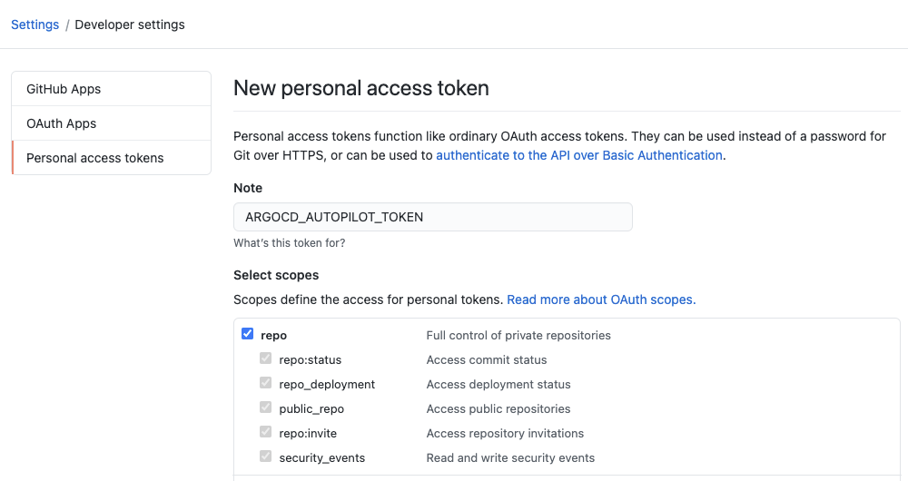
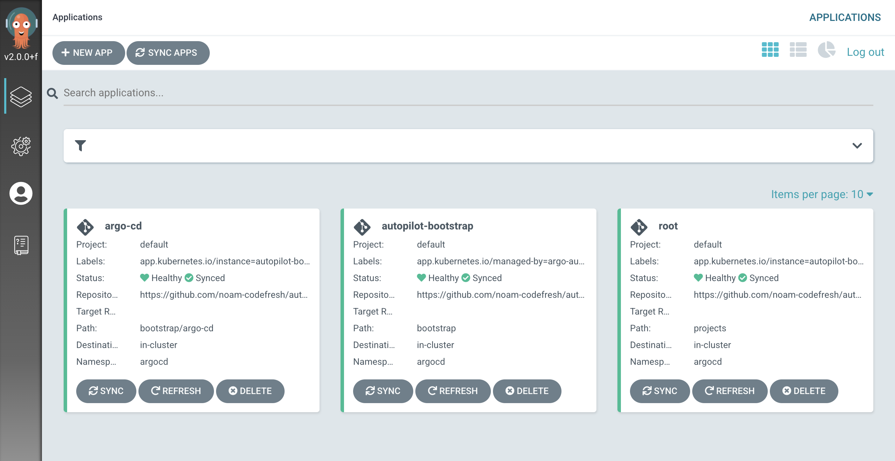
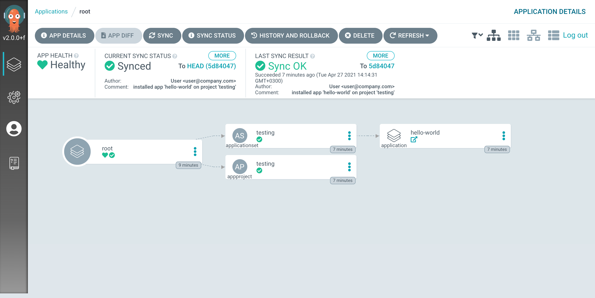
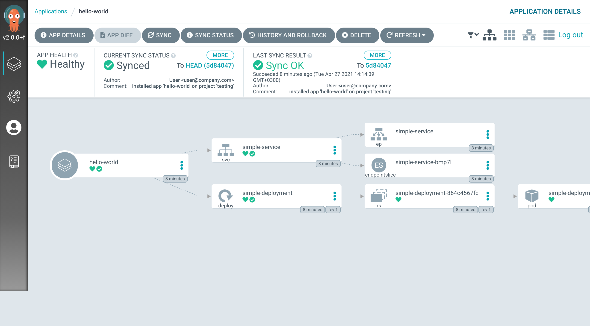

# Getting Started

This guide assumes you are familiar with Argo CD and its basic concepts. See the [Argo CD documentation](https://argoproj.github.io/Argo CD/core_concepts/) for more information.

## Before you begin 
### Requirements

* Installed [kubectl](https://kubernetes.io/docs/tasks/tools/install-kubectl/) command-line tool
* Have a [kubeconfig](https://kubernetes.io/docs/tasks/access-application-cluster/configure-access-multiple-clusters/) file (default location is `~/.kube/config`)

### Git authentication
Make sure to have a valid token (https://docs.github.com/en/github/authenticating-to-github/creating-a-personal-access-token)

```
export GIT_TOKEN=ghp_PcZ...IP0
```

If you have already created your GitOps Repository, you can skip the following step
### Create a new GitOps Repository
```
argocd-autopilot repo create --owner <owner> --name <name>
```

### Export Clone URL
You can use any clone URL to a valid git repo, provided that the token you supplied earlier will allow cloning from, and pushing to it.
```
export GIT_REPO=https://github.com/owner/name
```

#### Optional
If you want the autopilot-managed folder structure to reside under some sub-folder in your repository, you can also export the following env variable:
```
export GIT_INSTALLATION_PATH=some/relative/path
```

All the following commands will use the variables you supplied in order to manage your GitOps repository.

## Set up the GitOps repository
```
argocd-autopilot repo bootstrap
```
The execution might take several minutes, while your k8s cluster downloads the required images for Argo CD.
Once it completes, you will get the initial Argo CD admin password, as well as the command to run to enable port-forwarding:
```
INFO argocd initialized. password: pfrDVRJZtHYZKzBv 
INFO run:

    kubectl port-forward -n argocd svc/argocd-server 8080:80
```
<sub>(Your initial password will be different)</sub>

Execute the port forward command, and browse to http://localhost:8080. Log in using username `admin`, and the password from the previous step. your initial Argo CD deployment should look like this:



### Running Applications:
* autopilot-bootstrap - References the `bootstrap` directory in the GitOps repository, and manages the other 2 applications
* argo-cd - References the `bootstrap/argo-cd` folder, and manages the Argo CD deployment itself (including Argo CD ApplicationSet)
* root - References the `projects` directiry in the repo. The folder contains only an empty `DUMMY` file after the bootstrap command, so no projects will be created

## Add a Project and an Application
Execute the following commands to create a `testing` Project, and add a example Application to it:
```
argocd-autopilot project create testing
argocd-autopilot app create hello-world github.com/argoproj-labs/argocd-autopilot/examples/demo-app/ --p testing
```
<sub>* notice the trailing slash in the URL</sub>

After the application is created, and after Argo CD has finished its sync cycle, your new Project will appear under the *Root* application:



And the "hello-world" application will also be deployed to the cluster:


